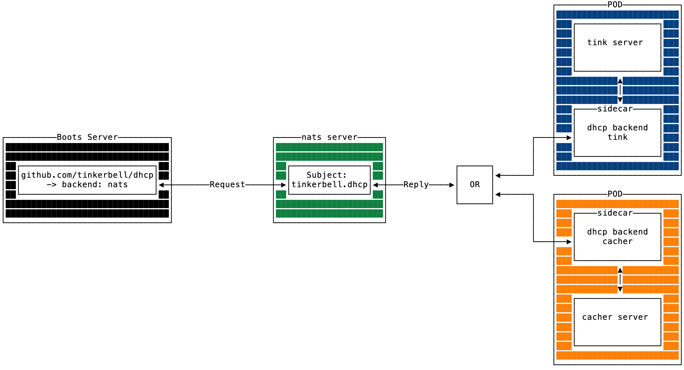

# nats.io

This backend implementation is for communicating messages via a nats subject.
This backend uses the [Request-Reply pattern](https://docs.nats.io/nats-concepts/core-nats/reqreply).

This backend allows the development and use of out-of-tree backends.
This will allow legacy backends like [cacher](https://github.com/tinkerbell/boots/blob/ac346cb685046d05ba5296dd0b2083b64fef3287/packet/client.go#L96) to be deprecated from this and other code bases (Boots for example).

## Architecture

