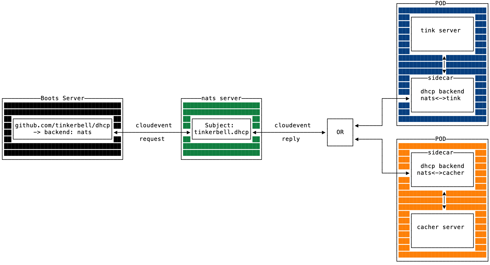

# nats.io

This backend implementation is for communicating messages via a [nats](https://nats.io/) message [subject](https://docs.nats.io/nats-concepts/subjects).
This backend uses the [Request-Reply pattern](https://docs.nats.io/nats-concepts/core-nats/reqreply).

This backend allows the development and use of out-of-tree backends.
This will allow legacy backends like [cacher](https://github.com/tinkerbell/boots/blob/ac346cb685046d05ba5296dd0b2083b64fef3287/packet/client.go#L96) to be deprecated from this and other code bases (Boots for example).

## Message Format

This backend uses the [cloudevents](https://cloudevents.io/) [spec](https://github.com/cloudevents/spec/blob/v1.0.2/cloudevents/spec.md) to send and receive messages.

Example:

```json
{
    "specversion" : "1.0",
    "type" : "com.github.pull_request.opened",
    "source" : "https://github.com/cloudevents/spec/pull",
    "subject" : "123",
    "id" : "A234-1234-1234",
    "time" : "2018-04-05T17:31:00Z",
    "comexampleextension1" : "value",
    "comexampleothervalue" : 5,
    "datacontenttype" : "application/json",
    "data" : "{\"key\":\"value\"}"
}
```

For the `data` field, the backend will send JSON of:

```go
// DHCPRequest is the data passed to listening backends.
type DHCPRequest struct {
    Mac net.HardwareAddr `json:"MacAddress"`
}

// create a cloudevent.
event := cloudevents.NewEvent()

// Set the data to the DHCPRequest struct.
event.SetData(cloudevents.ApplicationJSON, &DHCPRequest{Mac: mac})

// Be sure to add encoding of structured data to the context of the request.
ctx = cloudevents.WithEncodingStructured(ctx)
```

}

## Architecture

One of the trade-offs of using this backend architecture is that we've added an additional network hop.
The trade-off feels acceptable because of the functionality and flexibility enabled through out-of-tree backends.
Also, there are ways to decrease the impact of the additional network hop.
For example, we can position a sidecar as close to the data as possible.
See the diagram below.



## Running the Example

```bash
# 1. start the nats server
go run example/main.go -server

# 2. start an example nats client that will respond to messages on the nats dhcp subject.
go run example/main.go -responder

# 3. start the dhcp server
go run example/main.go

```
